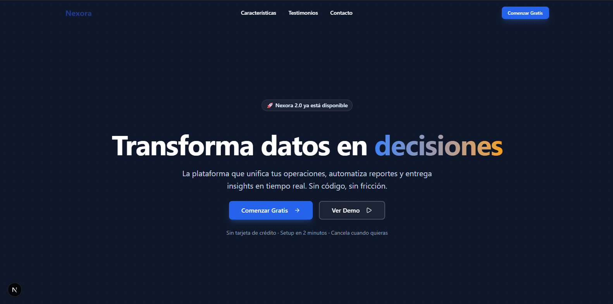
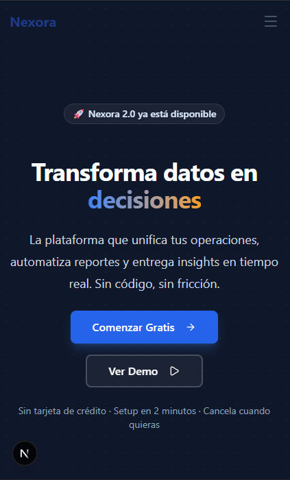

# Nexora — Landing Page Corporativa

Landing page moderna y responsiva para Nexora, una plataforma SaaS ficticia de análisis de datos operativos. Diseñada como proyecto de portafolio con enfoque en performance, accesibilidad y animaciones fluidas.


## 🚀 Demo

🔗 [Ver demo en Vercel](https://tu-url-de-vercel.vercel.app)

## 🛠️ Stack Tecnológico

- **Framework:** [Next.js 15](https://nextjs.org/) (App Router)
- **Lenguaje:** [TypeScript](https://www.typescriptlang.org/)
- **Estilos:** [Tailwind CSS](https://tailwindcss.com/)
- **Animaciones:** [Framer Motion](https://www.framer.com/motion/)
- **Íconos:** [Lucide React](https://lucide.dev/)
- **Fuentes:** [Inter](https://fonts.google.com/specimen/Inter) (next/font)

## ✨ Características

- ⚡ **Performance optimizada** — Server Components, next/font, next/image
- 📱 **Totalmente responsiva** — Mobile-first con breakpoints sm/md/lg
- 🎨 **Animaciones fluidas** — Framer Motion con stagger y viewport triggers
- ♿ **Accesibilidad** — Contraste WCAG, focus rings, aria-labels
- 🌙 **Dark hero + secciones claras** — Diseño moderno tipo SaaS

## 🚀 Instalación y uso

```bash
# Clonar repositorio
git clone https://github.com/MaoMachado/Landing-page-corporativa.git
cd Landing-page-corporativa

# Instalar dependencias
npm install

# Iniciar servidor de desarrollo
npm run dev

# Build de producción
npm run build
```

## 📸 Screenshots



